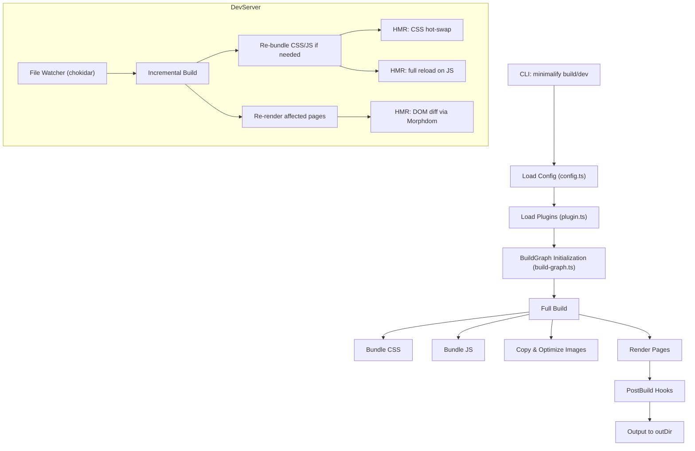
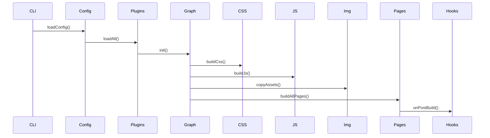
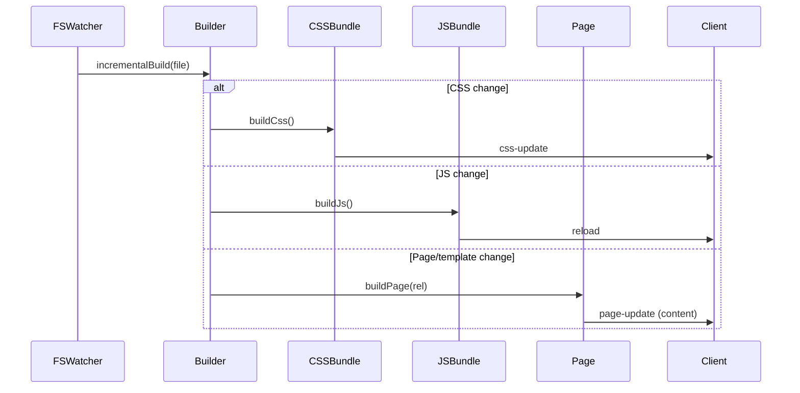

# Minimalify: Developer Guide

## Table of Contents

- [Overview](#overview)
- [Modules](#modules)
- [Data Structures & Algorithms](#data-structures--algorithms)
- [Build Pipeline](#build-pipeline)
  - [Bundle CSS](#bundle-css)
  - [Bundle JS](#bundle-js)
  - [Image Handling](#image-handling)
  - [Page Rendering](#page-rendering)
- [Dev Server & HMR](#dev-server--hmr)
- [Plugin Architecture](#plugin-architecture)
- [Caching Layers](#caching-layers)
- [Concurrency Model](#concurrency-model)
- [Extending Minimalify](#extending-minimalify)

## Overview

Minimalify is a zero-dependency static-site builder and dev server. It uses:

- A **Dependency Graph (DAG)** to track which pages depend on which assets
- **Incremental builds**: BFS to rebuild only affected pages
- **Caching**: HTTP asset cache, LRU transform cache, Bloom filter for URL dedupe
- **Parallelism**: p-limit worker pool for CPU-heavy transforms
- **Purging**: PurgeCSS to remove unused CSS selectors
- **Dev HMR**: CSS hot-swap, JS reload, page patch via Morphdom

This guide dives into its architecture and key algorithms.

## Modules

- **cli.ts**: parses commands (`build`, `dev`), loads config
- **config.ts**: validates & normalizes `minimalify.config.js` via AJV
- **build-graph.ts**: builds a DAG of dependencies (pages → css/js/tmpl/img)
- **build.ts**: `Builder` class implements full & incremental builds
- **dev.ts**: sets up Express server, WebSocket HMR, file-watcher
- **cache.ts**: `HTTPCache` with ETag/Last-Modified, metadata JSON
- **plugin.ts**: `PluginManager`, hook invocation
- **plugins/**: built-in plugins (analyzer, optimizer, seo, lint, etc.)

## Data Structures & Algorithms

- **DependencyGraph** (Maps & Sets):
  - `deps: Map<node, Set<dependency>>`
  - `rev: Map<dependency, Set<node>>>`
  - BFS on `rev` for incremental builds
- **LRU Cache** (lru-cache): memoizes CSS/JS/HTML transform output by content-hash
- **Bloom Filter** (bloom-filters): tracks fetched URLs to skip redundant HTTP GETs
- **Merkle-style Hashing**: each bundle's content hashed → skip transform if unchanged
- **Priority Queue** (p-limit): limits concurrency to `os.cpus().length` workers
- **PurgeCSS**: AST-based dead-CSS removal across all pages
- **AST Traversal** (parse5): inlining templates, rewriting tags
- **Debounced Watch** (lodash.debounce): coalesce rapid file events into single rebuild
- **Morphdom**: efficient DOM diff for page HMR

## Build Pipeline

### Bundle CSS

1. Scan HTML AST for shared CSS URLs (by `sharedDomains`)
2. Download via `HTTPCache` + Bloom filter
3. Read local CSS files
4. Purge unused selectors with PurgeCSS
5. PostCSS + cssnano in parallel (LRU cache by hash)
6. Write `styles.min.css`

### Bundle JS

1. Scan HTML AST for shared JS URLs
2. Download via `HTTPCache`
3. Read local JS files
4. Terser minification in parallel (LRU cache)
5. Write `bundle.min.js`

### Image Handling

- Copy local images
- Download shared images
- Optional Sharp optimization in parallel

### Page Rendering

1. `onPage` plugin hooks (lint, a11y, SEO)
2. Inline `<include-*>` templates with `{{param}}` & `{{children}}`
3. Strip old `<link>`/`<script>`, inject bundles
4. Rewrite shared `` URLs to `img/`
5. Serialize AST → `onPreHtmlMinify` hook → html-minifier-terser (LRU cache)
6. Write output HTML

## Dev Server & HMR

- **CSS HMR**: updates `<link>` href with timestamp query
- **JS HMR**: full page reload
- **Page HMR**: injects new HTML via Morphdom

## Plugin Architecture

- Plugins implement hooks (`onPreBuild`, `onAsset`, `onBundle`, `onPage`, `onPostBundle`, `onPreHtmlMinify`, `onPostBuild`, `onDevStart`, `onFileChange`)
- Loaded via `config.plugins[]`
- Can reorder inputs, modify content, perform audits, generate reports

## Caching Layers

- **HTTP Cache**: ETag/Last-Modified metadata, disk caching
- **Bloom Filter**: skip re-downloads quickly
- **Transform Cache**: LRU caches keyed by content-hash for PostCSS, Terser, HTML-minify

## Concurrency Model

- Uses `p-limit` with `os.cpus().length` to run transforms in parallel
- Worker pool for Sharp, PurgeCSS, PostCSS, Terser, HTML-minify

## Extending Minimalify

1. Create a plugin module under `plugins/lib`
2. Export a `Plugin` object with desired hooks
3. Add plugin name to `config.plugins[]`
4. Hooks receive context args: `cfg`, `pagePath`, `doc`, `type`, `content`

Enjoy building high-performance static sites with Minimalify!